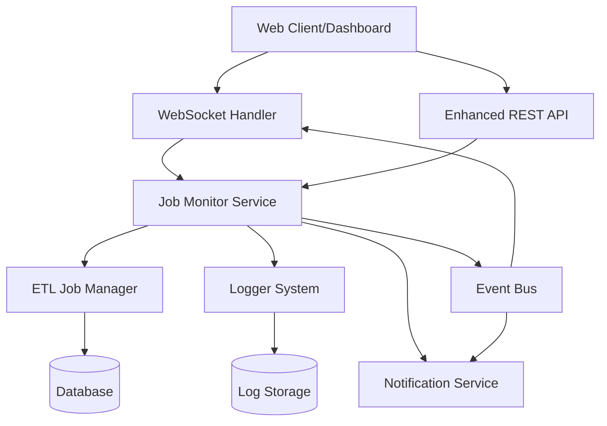

# Real-time Job Status Monitoring - Design Document

## Overview

This design document outlines the implementation of real-time job status monitoring for the ETL Plus system. The feature adds WebSocket-based real-time communication, enhanced REST API endpoints, and notification capabilities to provide comprehensive job monitoring and operational visibility.

The solution integrates with the existing ETL job management system, leveraging the current `ETLJobManager`, `Logger`, and `HttpServer` components while adding new WebSocket capabilities and enhanced monitoring features.

## Architecture

### High-Level Architecture



### Component Integration

The monitoring system integrates with existing components:
- **ETL Job Manager**: Enhanced with event publishing capabilities
- **HTTP Server**: Extended with WebSocket support using Boost.Beast WebSocket
- **Logger**: Enhanced with real-time log streaming
- **Database Manager**: Extended with monitoring data persistence

## Components and Interfaces

### 1. WebSocket Manager

**Purpose**: Manages WebSocket connections and real-time communication

**Interface**:
```cpp
class WebSocketManager {
public:
    void start();
    void stop();
    void broadcastJobUpdate(const JobStatusUpdate& update);
    void broadcastLogMessage(const LogMessage& message);
    void addConnection(std::shared_ptr<WebSocketConnection> connection);
    void removeConnection(const std::string& connectionId);
    void sendToConnection(const std::string& connectionId, const std::string& message);
    
private:
    std::unordered_map<std::string, std::shared_ptr<WebSocketConnection>> connections_;
    std::mutex connectionsMutex_;
    std::thread broadcastThread_;
};
```

**Key Features**:
- Connection lifecycle management
- Message broadcasting to all connected clients
- Selective message delivery based on filters
- Connection health monitoring and cleanup

### 2. Job Monitor Service

**Purpose**: Central monitoring service that coordinates job status tracking and event distribution

**Interface**:
```cpp
class JobMonitorService {
public:
    void initialize(std::shared_ptr<ETLJobManager> etlManager,
                   std::shared_ptr<WebSocketManager> wsManager,
                   std::shared_ptr<NotificationService> notifier);
    
    void onJobStatusChanged(const std::string& jobId, JobStatus oldStatus, JobStatus newStatus);
    void onJobProgressUpdated(const std::string& jobId, int progressPercent, const std::string& currentStep);
    void onJobLogGenerated(const std::string& jobId, const LogMessage& logMessage);
    
    JobMonitoringData getJobMonitoringData(const std::string& jobId);
    std::vector<JobMonitoringData> getAllActiveJobs();
    
private:
    std::shared_ptr<ETLJobManager> etlManager_;
    std::shared_ptr<WebSocketManager> wsManager_;
    std::shared_ptr<NotificationService> notifier_;
    std::unordered_map<std::string, JobMonitoringData> activeJobs_;
    std::mutex jobsMutex_;
};
```

### 3. Enhanced ETL Job Manager

**Purpose**: Extended existing ETL Job Manager with event publishing capabilities

**New Methods**:
```cpp
class ETLJobManager {
    // Existing methods...
    
    // New monitoring methods
    void setJobMonitorService(std::shared_ptr<JobMonitorService> monitor);
    void publishJobStatusUpdate(const std::string& jobId, JobStatus status);
    void publishJobProgress(const std::string& jobId, int progress, const std::string& step);
    
private:
    std::shared_ptr<JobMonitorService> monitorService_;
    
    // Enhanced job execution with progress tracking
    void executeJobWithMonitoring(std::shared_ptr<ETLJob> job);
};
```

### 4. WebSocket Connection Handler

**Purpose**: Handles individual WebSocket connections and message routing

**Interface**:
```cpp
class WebSocketConnection {
public:
    WebSocketConnection(tcp::socket socket);
    void start();
    void send(const std::string& message);
    void close();
    
    void setFilters(const ConnectionFilters& filters);
    bool shouldReceiveMessage(const MessageType& type, const std::string& jobId);
    
private:
    boost::beast::websocket::stream<tcp::socket> ws_;
    ConnectionFilters filters_;
    std::string connectionId_;
    std::queue<std::string> messageQueue_;
    std::mutex queueMutex_;
};
```

### 5. Notification Service

**Purpose**: Handles critical event notifications and alerting

**Interface**:
```cpp
class NotificationService {
public:
    void configure(const NotificationConfig& config);
    void sendJobFailureAlert(const std::string& jobId, const std::string& error);
    void sendJobTimeoutWarning(const std::string& jobId, int executionTimeMinutes);
    void sendResourceAlert(const ResourceAlert& alert);
    
private:
    NotificationConfig config_;
    std::queue<NotificationMessage> notificationQueue_;
    std::thread notificationWorker_;
};
```

### 6. Enhanced Request Handler

**Purpose**: Extended REST API endpoints for monitoring

**New Endpoints**:
- `GET /api/jobs/{id}/status` - Detailed job status with real-time data
- `GET /api/jobs/{id}/logs` - Job-specific log streaming
- `GET /api/jobs/{id}/metrics` - Job execution metrics
- `GET /api/monitor/jobs` - All jobs with filtering support
- `POST /api/monitor/config` - Update monitoring configuration
- `GET /api/monitor/connections` - Active WebSocket connections info

## Data Models

### Job Status Update Message
```cpp
struct JobStatusUpdate {
    std::string jobId;
    JobStatus status;
    JobStatus previousStatus;
    std::chrono::system_clock::time_point timestamp;
    int progressPercent;
    std::string currentStep;
    std::optional<std::string> errorMessage;
    JobMetrics metrics;
};
```

### Job Monitoring Data
```cpp
struct JobMonitoringData {
    std::string jobId;
    JobStatus status;
    int progressPercent;
    std::string currentStep;
    std::chrono::system_clock::time_point startTime;
    std::chrono::milliseconds executionTime;
    JobMetrics metrics;
    std::vector<LogMessage> recentLogs;
};
```

### Job Metrics
```cpp
struct JobMetrics {
    int recordsProcessed;
    int recordsSuccessful;
    int recordsFailed;
    double processingRate; // records per second
    size_t memoryUsage;
    double cpuUsage;
    std::chrono::milliseconds executionTime;
};
```

### WebSocket Message Format
```json
{
    "type": "job_status_update",
    "timestamp": "2025-08-09T10:30:00Z",
    "data": {
        "jobId": "job_123",
        "status": "RUNNING",
        "previousStatus": "PENDING",
        "progressPercent": 45,
        "currentStep": "Processing batch 3/7",
        "metrics": {
            "recordsProcessed": 4500,
            "recordsSuccessful": 4485,
            "recordsFailed": 15,
            "processingRate": 150.5,
            "executionTime": 30000
        }
    }
}
```

### Configuration Extensions
```json
{
    "monitoring": {
        "websocket": {
            "enabled": true,
            "port": 8081,
            "max_connections": 100,
            "heartbeat_interval": 30,
            "message_queue_size": 1000
        },
        "job_tracking": {
            "progress_update_interval": 5,
            "log_streaming_enabled": true,
            "metrics_collection_enabled": true,
            "timeout_warning_threshold": 1500
        },
        "notifications": {
            "enabled": true,
            "job_failure_alerts": true,
            "timeout_warnings": true,
            "resource_alerts": true,
            "retry_attempts": 3,
            "retry_delay": 5000
        }
    }
}
```

## Error Handling

### WebSocket Error Handling
- **Connection Failures**: Automatic reconnection with exponential backoff
- **Message Delivery Failures**: Queue messages and retry with circuit breaker pattern
- **Invalid Messages**: Log errors and send error response to client
- **Resource Exhaustion**: Implement connection limits and message queue size limits

### Job Monitoring Error Handling
- **ETL Job Failures**: Capture detailed error information and broadcast to connected clients
- **Monitoring Service Failures**: Graceful degradation with basic job status still available
- **Database Connection Issues**: Cache monitoring data temporarily and sync when connection restored

### Notification Error Handling
- **Delivery Failures**: Retry with exponential backoff up to configured limit
- **Configuration Errors**: Validate configuration on startup and reject invalid settings
- **Service Unavailability**: Queue notifications and deliver when service becomes available

## Testing Strategy

### Unit Tests
- **WebSocket Manager**: Connection management, message broadcasting, error handling
- **Job Monitor Service**: Event processing, data aggregation, filtering logic
- **Enhanced ETL Job Manager**: Progress tracking, event publishing, integration points
- **Notification Service**: Alert generation, delivery mechanisms, retry logic

### Integration Tests
- **WebSocket Communication**: End-to-end message flow from job events to client delivery
- **REST API Extensions**: New monitoring endpoints with various query parameters
- **Database Integration**: Monitoring data persistence and retrieval
- **Configuration Management**: Dynamic configuration updates and validation

### Performance Tests
- **WebSocket Scalability**: Test with multiple concurrent connections (target: 100+ connections)
- **Message Throughput**: High-frequency job updates and log streaming
- **Memory Usage**: Monitor memory consumption with long-running connections
- **Database Performance**: Monitoring data queries under load

### End-to-End Tests
- **Real-time Monitoring Workflow**: Complete job lifecycle with real-time updates
- **Multi-client Scenarios**: Multiple dashboard clients receiving updates simultaneously
- **Failure Recovery**: System behavior during component failures and recovery
- **Configuration Changes**: Dynamic configuration updates without service interruption

## Implementation Phases

### Phase 1: Core WebSocket Infrastructure
- Implement WebSocket manager and connection handling
- Basic message broadcasting capabilities
- Integration with existing HTTP server
- Configuration management for WebSocket settings

### Phase 2: Job Monitoring Integration
- Enhance ETL Job Manager with event publishing
- Implement Job Monitor Service
- Basic job status and progress tracking
- REST API extensions for monitoring data

### Phase 3: Advanced Features
- Real-time log streaming
- Notification service implementation
- Job metrics collection and reporting
- Connection filtering and selective updates

### Phase 4: Production Readiness
- Comprehensive error handling and recovery
- Performance optimization and scalability testing
- Security enhancements (authentication for WebSocket connections)
- Monitoring and observability for the monitoring system itself