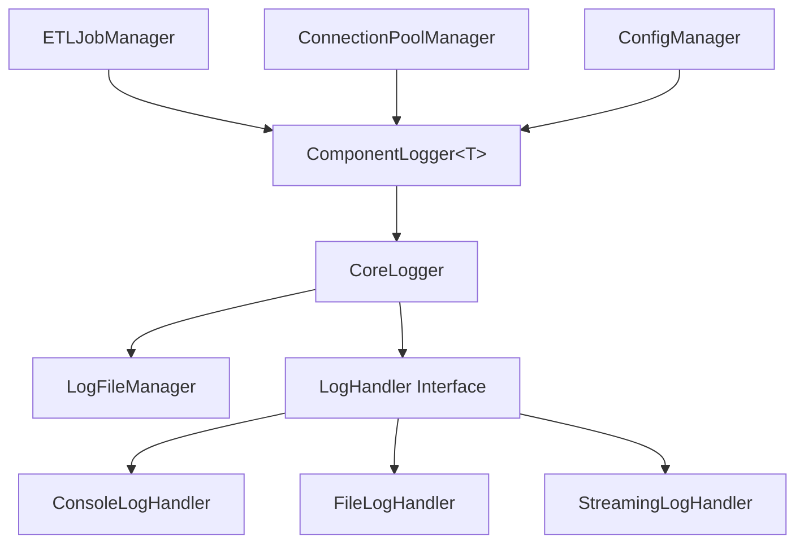
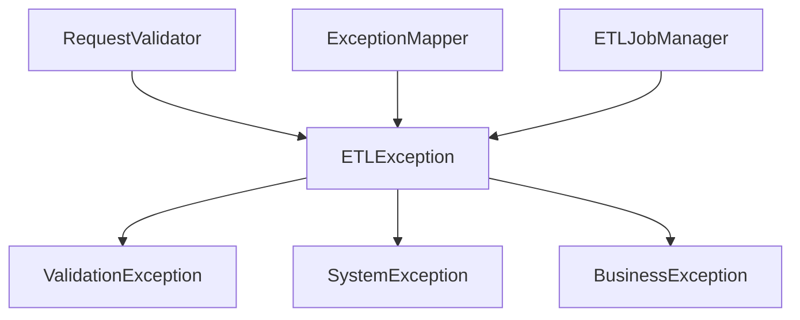
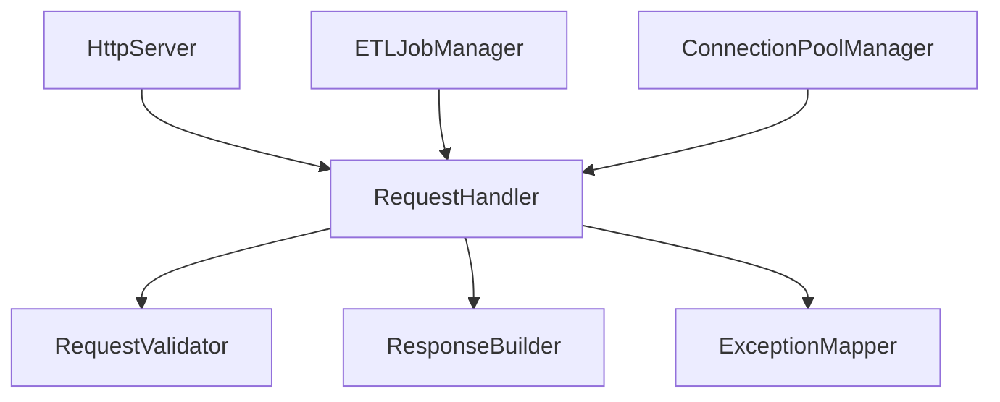
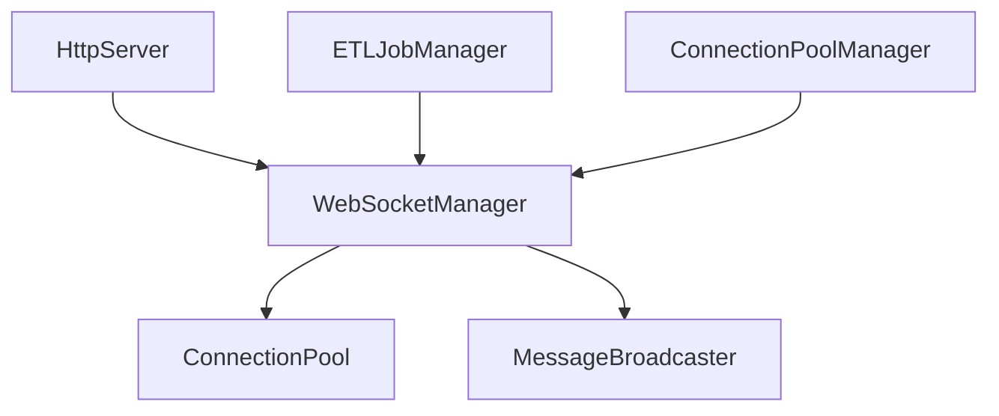

# ETL Plus Component Relationships

## Overview

This document details the relationships between components in the refactored ETL Plus system, including dependencies, interfaces, and interaction patterns.

## Core Component Dependencies

### Logger System Dependencies



**Key Relationships:**

- **ComponentLogger&lt;T&gt;** depends on **CoreLogger** for logging infrastructure
- **CoreLogger** depends on **LogFileManager** for file operations
- **CoreLogger** depends on **LogHandler Interface** for output destinations
- Multiple components use **ComponentLogger&lt;T&gt;** for type-safe logging

### Exception System Dependencies



**Key Relationships:**

- All exception types inherit from base **ETLException**
- **RequestValidator** throws **ValidationException** for input errors
- **ExceptionMapper** handles all exception types for HTTP responses
- Business logic components throw appropriate exception subtypes

### Request Processing Dependencies



**Key Relationships:**

- **HttpServer** routes requests to **RequestHandler**
- **RequestHandler** orchestrates **RequestValidator**, **ResponseBuilder**, and **ExceptionMapper**
- Business components (**ETLJobManager**, **ConnectionPoolManager**) integrate with **RequestHandler**

### WebSocket System Dependencies



**Key Relationships:**

- **WebSocketManager** coordinates **ConnectionPool** and **MessageBroadcaster**
- **HttpServer** integrates WebSocket functionality
- Business components publish real-time updates via **WebSocketManager**

## Component Interface Contracts

### Logger System Interfaces

#### LogHandler Interface

```cpp
class LogHandler {
public:
    virtual ~LogHandler() = default;
    virtual void write(const LogEntry& entry) = 0;
    virtual void flush() = 0;
    virtual bool isEnabled(LogLevel level) const = 0;
};
```

**Contract Requirements:**

- Thread-safe implementation
- Efficient write operations
- Proper resource cleanup
- Level-based filtering support

#### ComponentLogger Interface

```cpp
template<typename T>
class ComponentLogger {
public:
    void info(const std::string& message);
    void warn(const std::string& message);
    void error(const std::string& message);
    // ... other logging methods
};
```

**Contract Requirements:**

- Type-safe component identification
- Automatic component name resolution
- Consistent logging format
- Performance-optimized for frequent calls

### Exception System Interfaces

#### ETLException Interface

```cpp
class ETLException : public std::exception {
public:
    ETLException(ErrorCode code, const std::string& message);
    ErrorCode getErrorCode() const;
    std::string getCorrelationId() const;
    nlohmann::json toJson() const;
};
```

**Contract Requirements:**

- Error code mapping
- Correlation ID generation
- JSON serialization for logging
- Backward compatibility with legacy codes

### Request Processing Interfaces

#### RequestValidator Interface

```cpp
class RequestValidator {
public:
    ValidationResult validate(const HttpRequest& request);
    void addRule(std::unique_ptr<ValidationRule> rule);
};
```

**Contract Requirements:**

- Comprehensive input validation
- Security checks implementation
- Extensible rule system
- Detailed error reporting

#### ResponseBuilder Interface

```cpp
class ResponseBuilder {
public:
    ResponseBuilder& status(int code);
    ResponseBuilder& header(const std::string& key, const std::string& value);
    ResponseBuilder& body(const std::string& content);
    HttpResponse build();
};
```

**Contract Requirements:**

- Fluent interface design
- Content negotiation support
- CORS header management
- Error response formatting

### WebSocket System Interfaces

#### ConnectionPool Interface

```cpp
class ConnectionPool {
public:
    std::shared_ptr<WebSocketConnection> acquire();
    void release(std::shared_ptr<WebSocketConnection> connection);
    size_t getActiveConnections() const;
    void cleanup();
};
```

**Contract Requirements:**

- Connection lifecycle management
- Resource limits enforcement
- Health monitoring
- Thread-safe operations

#### MessageBroadcaster Interface

```cpp
class MessageBroadcaster {
public:
    void broadcast(const std::string& message);
    void sendTo(const std::string& clientId, const std::string& message);
    void filterAndBroadcast(const MessageFilter& filter, const std::string& message);
};
```

**Contract Requirements:**

- Efficient message distribution
- Selective broadcasting support
- Message filtering capabilities
- Delivery guarantees

## Component Interaction Patterns

### Synchronous Interactions

#### Direct Method Calls

```cpp
// Component A calls Component B directly
class ComponentA {
    ComponentB& componentB;

    void process() {
        auto result = componentB.doSomething();
        // Process result
    }
};
```

**Usage Patterns:**

- Same-layer component communication
- Tight coupling acceptable
- Immediate response required
- Simple, predictable interactions

#### Template-Based Calls

```cpp
// Type-safe component interactions
template<typename T>
class ComponentRegistry {
    template<typename U>
    U& getComponent() {
        return *static_cast<U*>(components[typeid(U).name()]);
    }
};
```

**Usage Patterns:**

- Type-safe component resolution
- Compile-time dependency checking
- Zero-cost abstractions
- Template metaprogramming benefits

### Asynchronous Interactions

#### Message Queue Pattern

```cpp
// Decoupled component communication
class MessageQueue {
    void send(const Message& message);
    Message receive();
};

class Producer {
    MessageQueue& queue;

    void produce() {
        Message msg = createMessage();
        queue.send(msg);
    }
};
```

**Usage Patterns:**

- Loose coupling between components
- Load balancing and scalability
- Fault tolerance and reliability
- Complex workflow orchestration

#### Observer Pattern

```cpp
// Event-driven component interactions
class Observable {
    void addObserver(Observer* observer);
    void notifyObservers(const Event& event);
};

class Observer {
    virtual void onEvent(const Event& event) = 0;
};
```

**Usage Patterns:**

- State change notifications
- Event-driven architectures
- Plugin system implementations
- Real-time data updates

## Component Lifecycle Management

### Initialization Order

1. **Configuration Components**
   - ConfigManager (loads system configuration)
   - Environment detection and setup

2. **Infrastructure Components**
   - Logger system (CoreLogger, LogFileManager)
   - Exception system (exception hierarchy)
   - Connection pools (database, WebSocket)

3. **Business Components**
   - ETLJobManager (depends on logging, connections)
   - RequestHandler (depends on validators, builders)
   - WebSocketManager (depends on connection pools)

4. **Integration Components**
   - HttpServer (integrates all request processing)
   - Monitoring and metrics collection

### Shutdown Order

1. **Stop Accepting New Work**
   - HttpServer stops accepting requests
   - WebSocketManager stops new connections

2. **Drain Existing Work**
   - Complete in-flight requests
   - Flush pending messages
   - Close active connections gracefully

3. **Cleanup Resources**
   - Close database connections
   - Flush log buffers
   - Release system resources

4. **Final Cleanup**
   - Destroy components in reverse initialization order
   - Log final statistics
   - Exit cleanly

## Error Propagation and Handling

### Exception Propagation Chain

```text
Business Logic ──► Component Exception ──► ExceptionMapper ──► HTTP Response
      │                       │                       │
      ▼                       ▼                       ▼
   ETLException        Error Context         Error Response
   Subtypes           Correlation ID         JSON Format
```

### Error Context Preservation

```cpp
class ErrorContext {
    std::string correlationId;
    std::string componentName;
    std::string operationName;
    nlohmann::json additionalData;

    void addContext(const std::string& key, const nlohmann::json& value);
    nlohmann::json toJson() const;
};
```

**Context Preservation Rules:**

- Correlation ID generated at request entry point
- Component name automatically added by ComponentLogger
- Operation context preserved through call chain
- Additional context data accumulated throughout processing

## Performance Considerations

### Component Communication Overhead

- **Direct Calls**: Minimal overhead, suitable for frequent interactions
- **Message Queues**: Higher overhead, suitable for decoupling
- **Observer Pattern**: Moderate overhead, suitable for event distribution

### Resource Management

- **Connection Pools**: Reuse expensive resources (database connections)
- **Object Pools**: Cache frequently created objects
- **Thread Pools**: Manage concurrent operations efficiently

### Monitoring and Metrics

- **Component Health**: Track component availability and performance
- **Resource Usage**: Monitor memory, CPU, and connection usage
- **Error Rates**: Track and alert on error conditions
- **Performance Metrics**: Response times, throughput, latency

## Testing and Validation

### Component Interface Testing

```cpp
class MockLogHandler : public LogHandler {
    void write(const LogEntry& entry) override {
        // Capture log entries for verification
    }
};
```

### Integration Testing

```cpp
class ComponentIntegrationTest {
    void testRequestProcessingPipeline() {
        // Test RequestValidator → RequestHandler → ResponseBuilder
    }
};
```

### Performance Testing

```cpp
class ComponentPerformanceTest {
    void benchmarkComponentInteractions() {
        // Measure inter-component communication performance
    }
};
```

## Future Extensibility

### Plugin Architecture

- **Component Factories**: Pluggable component implementations
- **Handler Registries**: Dynamic handler registration
- **Extension Points**: Well-defined extension interfaces

### API Evolution

- **Versioning Strategy**: API versioning for backward compatibility
- **Deprecation Policy**: Graceful deprecation of old interfaces
- **Migration Support**: Tools and guides for API migration

This document provides the foundation for understanding and maintaining the component relationships in the ETL Plus system. Regular updates to this document are recommended as the system evolves.
