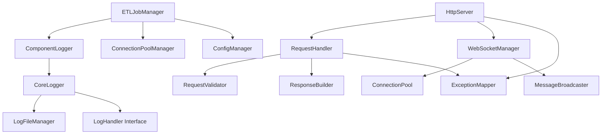

# ETL Plus System Architecture

## Overview

The ETL Plus system has been comprehensively refactored to improve maintainability, performance, and scalability. This document describes the new architecture, component relationships, and design patterns implemented during the refactoring process.

## Architecture Principles

### 1. Component-Based Architecture

- **Separation of Concerns**: Each component has a single, well-defined responsibility
- **Loose Coupling**: Components communicate through well-defined interfaces
- **High Cohesion**: Related functionality is grouped within components
- **Dependency Injection**: Components are designed for easy testing and replacement

### 2. Template-Based Design

- **Compile-Time Polymorphism**: Template classes for type-safe component interactions
- **Zero-Cost Abstractions**: Template-based designs with no runtime overhead
- **Type Safety**: Strong typing prevents runtime errors and improves maintainability

### 3. Exception Safety and Error Handling

- **Simplified Exception Hierarchy**: Streamlined exception system with clear error categories
- **Context-Aware Exceptions**: Rich error context with correlation IDs for debugging
- **Graceful Degradation**: System continues operating even when individual components fail

## Core Components

### 1. Logger System

#### Architecture

```text
ComponentLogger<T> ────┐
    │                   │
    ▼                   ▼
CoreLogger ───────── Handler Pattern
    │                   ▲
    ▼                   │
LogFileManager ────────┘
```

#### Key Components

- **ComponentLogger&lt;T&gt;**: Template-based logger for type-safe component identification
- **CoreLogger**: Central logging coordinator with async processing and metrics
- **LogFileManager**: File operations, rotation, archiving, and compression
- **LogHandler Interface**: Pluggable handler system for different output destinations

#### Design Patterns

- **Strategy Pattern**: Pluggable log handlers
- **Template Method**: Component-specific logging behavior
- **Observer Pattern**: Multiple handlers per logger
- **Factory Pattern**: Handler creation and configuration

### 2. Exception System

#### Architecture

```text
ETLException (Base)
    │
    ├── ValidationException
    ├── SystemException
    └── BusinessException
```

#### Key Features

- **Simplified Hierarchy**: Three main exception types covering all use cases
- **Error Context**: Rich context information with correlation IDs
- **Serialization**: Exception data can be serialized for logging and transmission
- **Migration Support**: Backward compatibility with legacy error codes

### 3. Request Processing Pipeline

#### Request Processing Architecture

```text
HTTP Request ──► RequestValidator ──► RequestHandler ──► ResponseBuilder ──► HTTP Response
                       │                       │                       │
                       ▼                       ▼                       ▼
                 ValidationException    ExceptionMapper ─────► Error Response
```

#### Request Processing Components

- **RequestValidator**: Input validation, security checks, parameter extraction
- **RequestHandler**: Business logic orchestration using validator and builder
- **ResponseBuilder**: Response construction with content negotiation and CORS
- **ExceptionMapper**: Exception to HTTP response mapping with correlation tracking

#### Request Processing Design Patterns

- **Chain of Responsibility**: Request processing pipeline
- **Builder Pattern**: Fluent response construction
- **Strategy Pattern**: Pluggable validation and mapping strategies

### 4. WebSocket Management System

#### WebSocket System Architecture

```text
WebSocketManager (Coordinator)
    │
    ├── ConnectionPool
    │       │
    │       ├── Connection Lifecycle
    │       ├── Health Monitoring
    │       └── Resource Management
    │
    └── MessageBroadcaster
            │
            ├── Message Filtering
            ├── Selective Broadcasting
            └── Delivery Guarantees
```

#### WebSocket System Components

- **WebSocketManager**: Coordinator managing the entire WebSocket system
- **ConnectionPool**: Connection lifecycle, health monitoring, and resource management
- **MessageBroadcaster**: Message distribution with filtering and delivery guarantees

#### WebSocket Design Patterns

- **Coordinator Pattern**: Central coordination of WebSocket operations
- **Pool Pattern**: Efficient connection management and reuse
- **Publisher-Subscriber**: Message broadcasting to connected clients

## Component Relationships

### Dependency Graph



### Communication Patterns

#### Synchronous Communication

- **Direct Method Calls**: Components within the same layer
- **Template-Based Calls**: Type-safe component interactions
- **Interface-Based Calls**: Pluggable component implementations

#### Asynchronous Communication

- **Message Queues**: Decoupled component communication
- **Event-Driven**: Observer pattern for state changes
- **Callback Registration**: Component lifecycle notifications

## Data Flow Architecture

### Request Processing Flow

1. **HTTP Request Reception**
   - HttpServer receives incoming request
   - Request routed to appropriate RequestHandler

2. **Validation Phase**
   - RequestValidator performs input validation
   - Security checks and parameter extraction
   - ValidationException thrown on validation failure

3. **Business Logic Processing**
   - RequestHandler orchestrates business logic
   - Uses validated input from RequestValidator
   - Prepares data for ResponseBuilder

4. **Response Construction**
   - ResponseBuilder creates HTTP response
   - Content negotiation and serialization
   - CORS headers and error handling

5. **Exception Handling**
   - Any exceptions caught by ExceptionMapper
   - Mapped to appropriate HTTP status codes
   - Error responses with correlation IDs

### WebSocket Data Flow

1. **Connection Establishment**
   - WebSocketManager handles connection requests
   - ConnectionPool manages connection lifecycle
   - Health monitoring and resource allocation

2. **Message Processing**
   - Incoming messages routed to appropriate handlers
   - MessageBroadcaster handles distribution
   - Filtering and selective broadcasting

3. **Real-time Updates**
   - System events trigger broadcasts
   - Message queuing for reliable delivery
   - Connection health monitoring

## Configuration Architecture

### Configuration Hierarchy

```text
Global Config
    │
    ├── Component Config
    │       │
    │       ├── Logger Config
    │       ├── WebSocket Config
    │       ├── Database Config
    │       └── Security Config
    │
    └── Environment Overrides
```

### Configuration Patterns

- **Centralized Configuration**: Single source of truth for all settings
- **Environment-Specific Overrides**: Different settings per deployment environment
- **Runtime Configuration**: Dynamic configuration updates without restart
- **Validation**: Configuration validation at startup and runtime

## Security Architecture

### Authentication and Authorization

- **Component-Level Security**: Each component validates access permissions
- **Request Validation**: Input sanitization and security checks
- **Connection Security**: Secure WebSocket connections with authentication
- **Audit Logging**: Comprehensive security event logging

### Data Protection

- **Input Validation**: All input validated and sanitized
- **Output Encoding**: Safe output encoding to prevent injection attacks
- **Secure Defaults**: Security-by-default configuration
- **Error Handling**: Secure error messages without information leakage

## Performance Architecture

### Optimization Strategies

- **Asynchronous Processing**: Non-blocking operations for high throughput
- **Connection Pooling**: Efficient resource management and reuse
- **Caching**: Strategic caching to reduce database load
- **Lazy Loading**: On-demand resource initialization

### Monitoring and Metrics

- **Performance Metrics**: Response times, throughput, resource usage
- **Health Checks**: Component health monitoring and reporting
- **Resource Monitoring**: Memory, CPU, and connection pool usage
- **Logging Integration**: Performance data integrated with logging system

## Deployment Architecture

### Containerization

- **Docker Support**: Containerized deployment with proper layering
- **Configuration Injection**: Environment-based configuration
- **Health Checks**: Container health monitoring and restart policies
- **Resource Limits**: CPU and memory limits for predictable performance

### Orchestration

- **Kubernetes Integration**: K8s manifests for production deployment
- **Service Discovery**: Automatic service registration and discovery
- **Load Balancing**: Traffic distribution across multiple instances
- **Rolling Updates**: Zero-downtime deployment and rollback

## Migration and Compatibility

### Backward Compatibility

- **API Compatibility**: Existing APIs maintained with deprecation warnings
- **Configuration Compatibility**: Existing configurations continue to work
- **Data Compatibility**: No database schema changes required
- **Extension Compatibility**: Custom extensions continue to work

### Migration Strategy

- **Gradual Migration**: Components can be migrated individually
- **Feature Flags**: New features can be enabled incrementally
- **Rollback Support**: Easy rollback to previous versions
- **Testing**: Comprehensive testing at each migration step

## Quality Assurance

### Testing Strategy

- **Unit Testing**: Comprehensive unit tests for all components
- **Integration Testing**: Component interaction and interface testing
- **Performance Testing**: Load testing and performance validation
- **Security Testing**: Security validation and penetration testing

### Code Quality

- **Static Analysis**: Automated code quality checks
- **Code Coverage**: Minimum 85% code coverage requirement
- **Documentation**: Comprehensive API and architecture documentation
- **Review Process**: Code review requirements and standards

## Future Extensibility

### Plugin Architecture

- **Component Plugins**: Pluggable component implementations
- **Handler Extensions**: Custom log handlers and exception mappers
- **Protocol Extensions**: Support for additional communication protocols
- **Storage Extensions**: Pluggable storage backends

### API Evolution

- **Versioning**: API versioning for backward compatibility
- **Deprecation**: Graceful deprecation of old APIs
- **Migration Tools**: Automated migration assistance
- **Documentation**: Comprehensive migration guides

This architecture provides a solid foundation for the ETL Plus system, enabling maintainability, scalability, and extensibility while maintaining backward compatibility with existing deployments.
