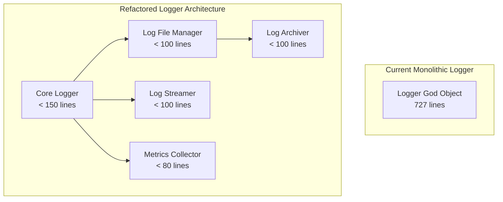

# Code Refactoring Design Document

## Overview

This design document outlines the architectural approach for refactoring the ETL Plus system to address identified code quality issues, reduce technical debt, and improve maintainability. The refactoring effort focuses on decomposing large classes, simplifying complex hierarchies, and establishing clear separation of concerns while maintaining backward compatibility and system performance.

## Current Architecture Analysis

### Identified Anti-Patterns

#### God Object Pattern
- **Logger Class**: 727 lines with multiple responsibilities (logging, streaming, file management, historical access, metrics)
- **RequestHandler Class**: 973 lines handling validation, processing, response building, and exception mapping
- **ETLJobManager Class**: 716 lines managing job lifecycle, execution, monitoring, and metrics

#### Complex Inheritance Hierarchies
- **Exception System**: 8 specialized exception classes with overlapping responsibilities
- **50+ Error Codes**: Scattered across multiple enums without clear organization

#### Tight Coupling Issues
- **WebSocket Dependencies**: Direct coupling between connection management and message broadcasting
- **Logger Dependencies**: Real-time streaming tightly coupled with core logging functionality
- **Shared State**: Multiple classes sharing complex state through global mutexes

## Target Architecture

### Architectural Principles

1. **Single Responsibility Principle**: Each class should have one reason to change
2. **Dependency Inversion**: Depend on abstractions, not concretions
3. **Interface Segregation**: Clients should not be forced to depend on interfaces they don't use
4. **Open/Closed Principle**: Open for extension, closed for modification

### Component Architecture



## Detailed Component Design

### 1. Logger System Refactoring

#### Core Logger Class
**Responsibilities**: Basic logging operations, level filtering, message formatting
**Interface**:
```cpp
class CoreLogger {
public:
    void log(LogLevel level, const std::string& component, const std::string& message, 
             const LogContext& context = {});
    void setLevel(LogLevel level);
    LogLevel getLevel() const;
    
    void addHandler(std::shared_ptr<LogHandler> handler);
    void removeHandler(const std::string& handlerId);
    
private:
    LogLevel currentLevel_;
    std::vector<std::shared_ptr<LogHandler>> handlers_;
    mutable std::shared_mutex handlersMutex_;
};
```

#### Log Handler Interface
**Purpose**: Polymorphic log output destinations
```cpp
class LogHandler {
public:
    virtual ~LogHandler() = default;
    virtual void handle(const LogEntry& entry) = 0;
    virtual std::string getId() const = 0;
    virtual bool shouldHandle(const LogEntry& entry) const = 0;
};

class FileLogHandler : public LogHandler { /* File output */ };
class ConsoleLogHandler : public LogHandler { /* Console output */ };
class StreamingLogHandler : public LogHandler { /* WebSocket streaming */ };
```

#### Log File Manager
**Responsibilities**: File operations, rotation, directory management
```cpp
class LogFileManager {
public:
    explicit LogFileManager(const FileConfig& config);
    
    void writeToFile(const std::string& formattedMessage);
    void rotateIfNeeded();
    void setRotationPolicy(std::unique_ptr<RotationPolicy> policy);
    
    std::vector<LogFileInfo> listLogFiles() const;
    bool archiveFile(const std::string& filename);
    
private:
    FileConfig config_;
    std::unique_ptr<RotationPolicy> rotationPolicy_;
    std::ofstream currentFile_;
    std::atomic<size_t> currentFileSize_{0};
    mutable std::mutex fileMutex_;
};
```

#### Real-time Log Streamer
**Responsibilities**: WebSocket integration, message queuing, filtering
```cpp
class LogStreamer {
public:
    explicit LogStreamer(std::shared_ptr<WebSocketManager> wsManager);
    
    void streamMessage(const LogEntry& entry);
    void setJobFilter(const std::unordered_set<std::string>& jobIds);
    void setLevelFilter(LogLevel minLevel);
    
    void startStreaming();
    void stopStreaming();
    
private:
    std::shared_ptr<WebSocketManager> wsManager_;
    std::queue<LogMessage> messageQueue_;
    StreamingConfig config_;
    std::thread streamingWorker_;
    mutable std::mutex queueMutex_;
};
```

### 2. Exception System Simplification

#### Simplified Exception Hierarchy
```cpp
// Base exception with error context
class ETLException : public std::exception {
public:
    ETLException(ErrorCode code, std::string message, ErrorContext context = {});
    
    ErrorCode getCode() const { return errorCode_; }
    const std::string& getMessage() const { return message_; }
    const ErrorContext& getContext() const { return context_; }
    const char* what() const noexcept override { return message_.c_str(); }
    
    std::string toLogString() const;
    
private:
    ErrorCode errorCode_;
    std::string message_;
    ErrorContext context_;
};

// Specialized exceptions for major categories
class ValidationException : public ETLException {
public:
    ValidationException(ErrorCode code, std::string message, 
                       std::string field = "", std::string value = "");
    
    const std::string& getField() const { return field_; }
    const std::string& getValue() const { return value_; }
    
private:
    std::string field_;
    std::string value_;
};

class SystemException : public ETLException {
public:
    SystemException(ErrorCode code, std::string message, 
                   std::string component = "");
    
    const std::string& getComponent() const { return component_; }
    
private:
    std::string component_;
};

class BusinessException : public ETLException {
public:
    BusinessException(ErrorCode code, std::string message, 
                     std::string operation = "");
    
    const std::string& getOperation() const { return operation_; }
    
private:
    std::string operation_;
};
```

#### Consolidated Error Codes
```cpp
enum class ErrorCode {
    // Validation errors (1000-1999)
    INVALID_INPUT = 1000,
    MISSING_FIELD = 1001,
    INVALID_FORMAT = 1002,
    INVALID_RANGE = 1003,
    
    // Authentication errors (2000-2999)
    UNAUTHORIZED = 2000,
    FORBIDDEN = 2001,
    TOKEN_EXPIRED = 2002,
    
    // System errors (3000-3999)
    DATABASE_ERROR = 3000,
    NETWORK_ERROR = 3001,
    FILE_ERROR = 3002,
    MEMORY_ERROR = 3003,
    
    // Business logic errors (4000-4999)
    JOB_NOT_FOUND = 4000,
    JOB_ALREADY_RUNNING = 4001,
    INVALID_JOB_STATE = 4002,
    PROCESSING_FAILED = 4003
};
```

### 3. Request Handler Decomposition

#### Request Validator
**Responsibilities**: Input validation, parameter extraction, security checks
```cpp
class RequestValidator {
public:
    ValidationResult validateRequest(const HttpRequest& request);
    ValidationResult validatePath(const std::string& path);
    ValidationResult validateMethod(const std::string& method);
    ValidationResult validateHeaders(const HeaderMap& headers);
    ValidationResult validateBody(const std::string& body);
    
private:
    std::unordered_set<std::string> allowedMethods_;
    std::unique_ptr<InputValidator> inputValidator_;
    std::unique_ptr<SecurityValidator> securityValidator_;
};
```

#### Response Builder
**Responsibilities**: HTTP response construction, content negotiation, serialization
```cpp
class ResponseBuilder {
public:
    HttpResponse success(const std::string& data, ContentType type = ContentType::JSON);
    HttpResponse error(const ETLException& exception);
    HttpResponse notFound(const std::string& resource);
    HttpResponse badRequest(const ValidationResult& validation);
    
    ResponseBuilder& setHeader(const std::string& name, const std::string& value);
    ResponseBuilder& setCors(const CorsConfig& config);
    
private:
    HeaderMap defaultHeaders_;
    CorsConfig corsConfig_;
    std::unique_ptr<Serializer> serializer_;
};
```

#### Exception Mapper
**Responsibilities**: Exception to HTTP response mapping, error logging
```cpp
class ExceptionMapper {
public:
    HttpResponse mapException(const std::exception& ex, const RequestContext& context);
    
    void registerHandler(std::type_index type, ExceptionHandler handler);
    
private:
    std::unordered_map<std::type_index, ExceptionHandler> handlers_;
    std::shared_ptr<CoreLogger> logger_;
};
```

### 4. WebSocket Manager Decoupling

#### Connection Pool
**Responsibilities**: Connection lifecycle, health monitoring, cleanup
```cpp
class ConnectionPool {
public:
    void addConnection(std::shared_ptr<WebSocketConnection> connection);
    void removeConnection(const std::string& connectionId);
    std::shared_ptr<WebSocketConnection> getConnection(const std::string& id);
    
    std::vector<std::string> getActiveConnections() const;
    size_t getConnectionCount() const;
    
    void cleanup();
    
private:
    std::unordered_map<std::string, std::shared_ptr<WebSocketConnection>> connections_;
    mutable std::shared_mutex connectionsMutex_;
    std::thread cleanupWorker_;
};
```

#### Message Broadcaster
**Responsibilities**: Message distribution, filtering, queuing
```cpp
class MessageBroadcaster {
public:
    void broadcast(const Message& message);
    void sendToConnection(const std::string& connectionId, const Message& message);
    void sendToFiltered(const Message& message, const MessageFilter& filter);
    
    void setConnectionPool(std::shared_ptr<ConnectionPool> pool);
    
private:
    std::shared_ptr<ConnectionPool> connectionPool_;
    std::queue<PendingMessage> messageQueue_;
    std::thread broadcastWorker_;
    mutable std::mutex queueMutex_;
};
```

#### WebSocket Coordinator
**Responsibilities**: Component coordination, configuration management
```cpp
class WebSocketManager {
public:
    void start(const WebSocketConfig& config);
    void stop();
    
    void broadcastMessage(const std::string& message);
    void sendToConnection(const std::string& connectionId, const std::string& message);
    
    void handleUpgrade(TcpSocket socket);
    
private:
    std::shared_ptr<ConnectionPool> connectionPool_;
    std::shared_ptr<MessageBroadcaster> broadcaster_;
    WebSocketConfig config_;
    std::atomic<bool> running_{false};
};
```

### 5. Type Safety Improvements

#### Type Aliases and Strong Types
```cpp
// String handling type aliases
using StringMap = std::unordered_map<std::string, std::string, 
                                   TransparentStringHash, std::equal_to<>>;
using StringSet = std::unordered_set<std::string, 
                                   TransparentStringHash, std::equal_to<>>;

// Strong types for IDs
class JobId {
public:
    explicit JobId(std::string id) : value_(std::move(id)) {}
    const std::string& value() const { return value_; }
    
private:
    std::string value_;
};

class ConnectionId {
public:
    explicit ConnectionId(std::string id) : value_(std::move(id)) {}
    const std::string& value() const { return value_; }
    
private:
    std::string value_;
};
```

#### Template Utilities
```cpp
// Logging template helper
template<typename Component>
class ComponentLogger {
public:
    static void debug(const std::string& message, const LogContext& context = {}) {
        CoreLogger::getInstance().log(LogLevel::DEBUG, Component::name, message, context);
    }
    
    static void info(const std::string& message, const LogContext& context = {}) {
        CoreLogger::getInstance().log(LogLevel::INFO, Component::name, message, context);
    }
    
    // ... other levels
};

// Component traits
struct AuthManagerComponent {
    static constexpr const char* name = "AuthManager";
};

struct ETLJobManagerComponent {
    static constexpr const char* name = "ETLJobManager";
};

// Usage: ComponentLogger<AuthManagerComponent>::info("User logged in");
```

### 6. Concurrency Pattern Standardization

#### RAII Lock Helpers
```cpp
template<typename Mutex>
class ScopedTimedLock {
public:
    explicit ScopedTimedLock(Mutex& mutex, std::chrono::milliseconds timeout = std::chrono::milliseconds(5000))
        : mutex_(mutex), locked_(false) {
        locked_ = mutex_.try_lock_for(timeout);
        if (!locked_) {
            throw SystemException(ErrorCode::LOCK_TIMEOUT, "Failed to acquire lock within timeout");
        }
    }
    
    ~ScopedTimedLock() {
        if (locked_) {
            mutex_.unlock();
        }
    }
    
    bool owns_lock() const { return locked_; }
    
private:
    Mutex& mutex_;
    bool locked_;
};

// Usage
void someMethod() {
    ScopedTimedLock lock(someMutex_);
    // Critical section
}
```

#### Lock Ordering Documentation
```cpp
// Lock ordering to prevent deadlocks:
// Level 1: Configuration locks (configMutex_)
// Level 2: Container locks (connectionsMutex_, jobsMutex_)
// Level 3: Resource locks (fileMutex_, queueMutex_)
// Level 4: State locks (individual object mutexes)

class LockOrdering {
public:
    enum class Level {
        CONFIG = 1,
        CONTAINER = 2,
        RESOURCE = 3,
        STATE = 4
    };
    
    template<Level L>
    class OrderedMutex : public std::timed_mutex {
        static_assert(L >= Level::CONFIG && L <= Level::STATE);
    };
};
```

## Migration Strategy

### Phase 1: Logger System Refactoring
1. **Create Handler Interface**: Implement LogHandler base class and concrete implementations
2. **Extract File Management**: Move file operations to LogFileManager
3. **Separate Streaming**: Create LogStreamer for WebSocket integration
4. **Update Macros**: Replace with template-based ComponentLogger
5. **Maintain Compatibility**: Keep old interface as facade during transition

### Phase 2: Exception System Simplification
1. **Create New Hierarchy**: Implement simplified exception classes
2. **Consolidate Error Codes**: Group related codes together
3. **Update Throw Sites**: Replace existing exception usage
4. **Update Catch Blocks**: Modify exception handling code
5. **Remove Old Classes**: Clean up deprecated exception types

### Phase 3: Request Handler Decomposition
1. **Extract Validator**: Move validation logic to RequestValidator
2. **Create Response Builder**: Implement response construction logic
3. **Add Exception Mapper**: Handle exception to response mapping
4. **Update Request Flow**: Wire new components together
5. **Remove Duplicate Code**: Eliminate repeated patterns

### Phase 4: WebSocket Decoupling
1. **Create Connection Pool**: Extract connection management
2. **Implement Broadcaster**: Move message distribution logic
3. **Add Coordinator**: Create orchestrating WebSocketManager
4. **Update Dependencies**: Modify dependent components
5. **Test Integration**: Verify message flow and connections

### Phase 5: Type Safety and Concurrency
1. **Add Type Aliases**: Create convenient type definitions
2. **Implement Strong Types**: Add type-safe ID classes
3. **Create Lock Helpers**: Implement RAII lock utilities
4. **Document Lock Ordering**: Add deadlock prevention guidelines
5. **Standardize Patterns**: Apply consistent concurrency patterns

## Testing Strategy

### Unit Testing Approach
- **Isolated Component Testing**: Each new component tested independently
- **Mock Dependencies**: Use mocks for external dependencies
- **State Verification**: Verify internal state changes
- **Error Condition Testing**: Test error handling and recovery

### Integration Testing
- **Component Interaction**: Test component interfaces and communication
- **Performance Validation**: Ensure no performance regressions
- **Backward Compatibility**: Verify existing functionality preserved
- **Configuration Testing**: Test with various configuration combinations

### Regression Testing
- **Existing Test Suite**: All current tests must pass
- **API Contract Testing**: Verify public interfaces unchanged
- **Performance Benchmarks**: Maintain performance characteristics
- **Load Testing**: Verify system stability under load

## Performance Considerations

### Memory Usage
- **Reduced Object Size**: Smaller, focused classes use less memory
- **Shared Resources**: Pool common resources where appropriate
- **RAII Management**: Automatic resource cleanup prevents leaks

### CPU Performance
- **Reduced Lock Contention**: Smaller critical sections and better lock granularity
- **Template Optimization**: Compile-time optimizations for logging
- **Efficient Message Routing**: Optimized WebSocket message distribution

### I/O Performance
- **Async File Operations**: Non-blocking file I/O where beneficial
- **Batch Processing**: Group operations to reduce system calls
- **Connection Pooling**: Reuse connections to reduce overhead

## Risk Mitigation

### Technical Risks
- **Breaking Changes**: Comprehensive testing and gradual migration
- **Performance Regression**: Continuous benchmarking and optimization
- **Complex Dependencies**: Clear interface definitions and dependency injection

### Operational Risks
- **Deployment Issues**: Feature flags and incremental rollout
- **Monitoring Gaps**: Enhanced logging and metrics during transition
- **Rollback Capability**: Maintain ability to revert changes quickly

## Success Metrics

### Code Quality Metrics
- Average class size reduced from 500+ to < 200 lines
- Cyclomatic complexity reduced by 30%
- Code duplication reduced by 50%
- Test coverage increased to 85%+

### Performance Metrics
- Response time variance < 5%
- Memory usage increase < 10%
- CPU utilization maintained or improved
- Throughput maintained within 5%

### Maintainability Metrics
- Developer onboarding time reduced by 40%
- Bug fix time reduced by 30%
- Feature development time reduced by 25%
- Code review time reduced by 35%
