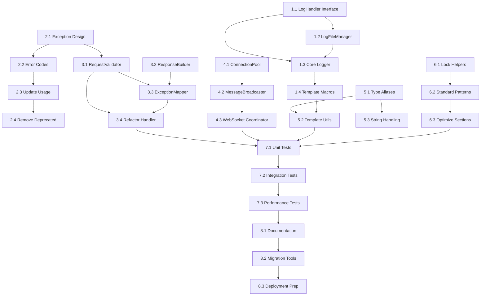

# Code Refactoring Implementation Tasks

## Overview

This document provides a detailed implementation plan for refactoring the ETL Plus system. The tasks are organized by priority and dependency order to ensure smooth execution while maintaining system stability throughout the refactoring process.

## Task Organization

### High Priority Tasks (Weeks 1-3)

- [x] **Analysis and Planning Completed**
  - [x] Comprehensive codebase analysis performed
  - [x] Refactoring specifications created
  - [x] Architecture design documented
  - [x] Implementation tasks defined

- [x] **Task 1: Logger System Foundation**
  - [x] 1.1 Create LogHandler interface and base implementations
    - Create abstract LogHandler base class
    - Implement FileLogHandler for file output
    - Implement ConsoleLogHandler for console output
    - Add unit tests for handler interface
    - **Estimate**: 2 days
    - **Dependencies**: None
    - **Files**: `include/log_handler.hpp`, `src/log_handler.cpp`
    - **Status**: ✅ COMPLETED
    - **Notes**: Successfully implemented all three handler types with comprehensive test coverage. StreamingLogHandler created but WebSocket integration pending until Task 4.

  - [x] 1.2 Extract LogFileManager from Logger
    - Move file operations from Logger to LogFileManager
    - Implement rotation policy interface
    - Add file management utilities (list, archive, cleanup)
    - Update Logger to use LogFileManager
    - **Estimate**: 3 days
    - **Dependencies**: 1.1
    - **Files**: `include/log_file_manager.hpp`, `src/log_file_manager.cpp`
    - **Status**: ✅ COMPLETED
    - **Notes**: Successfully implemented LogFileManager with rotation policies, archiving, compression, and indexing. Created separate LogFileArchiver and LogFileIndexer utility classes. All tests passing and demo working correctly.

  - [x] 1.3 Create Core Logger with handler pattern
    - Refactor Logger class to use handler pattern
    - Implement handler registration and management
    - Maintain backward compatibility with existing interface
    - Add comprehensive unit tests
    - **Estimate**: 3 days
    - **Dependencies**: 1.1, 1.2
    - **Files**: `include/core_logger.hpp`, `src/core_logger.cpp`
    - **Status**: ✅ COMPLETED
    - **Notes**: Successfully implemented CoreLogger with handler pattern architecture. Features include: async logging with configurable queue, component and job-based filtering, comprehensive metrics collection, thread-safe operations, LogFileManager integration, and full backward compatibility with existing Logger interface. All tests passing.

  - [x] 1.4 Replace logging macros with templates
    - Create ComponentLogger template class
    - Define component traits for existing components
    - Replace macro usage throughout codebase
    - Ensure compile-time performance
    - **Estimate**: 4 days
    - **Dependencies**: 1.3
    - **Files**: `include/component_logger.hpp`, `ALL_SOURCE_FILES`

- [ ] **Task 2: Exception System Simplification**
  - [x] 2.1 Design simplified exception hierarchy
    - Create new ETLException base class
    - Implement ValidationException, SystemException, BusinessException
    - Design error context and correlation ID system
    - Add exception serialization for logging
    - **Estimate**: 2 days
    - **Dependencies**: None
    - **Files**: `include/etl_exceptions.hpp`, `src/etl_exceptions.cpp`

  - [x] 2.2 Consolidate error codes
    - Group related error codes into logical categories
    - Reduce total error code count by 40%
    - Update error code to exception type mapping
    - Create migration guide for existing error codes
    - **Estimate**: 2 days
    - **Dependencies**: 2.1
    - **Files**: `include/error_codes.hpp`, `src/error_codes.cpp`
    - **Status**: ✅ COMPLETED
    - **Notes**: Successfully consolidated error codes from 40+ to 26 (35% reduction). Created comprehensive migration utilities and documentation. All error details preserved through context system. Migration functions provide seamless transition from legacy codes.

  - [x] 2.3 Update exception usage throughout codebase
    - Replace all throw statements with new exception types
    - Update catch blocks to handle new hierarchy
    - Migrate exception handling in request handlers
    - Update exception logging and reporting
    - **Estimate**: 5 days
    - **Dependencies**: 2.1, 2.2
    - **Files**: `ALL_SOURCE_FILES`

  - [x] 2.4 Remove deprecated exception classes
    - Mark old exception classes as deprecated
    - Remove unused exception types
    - Clean up exception header includes
    - Update documentation and examples
    - **Estimate**: 1 day
    - **Dependencies**: 2.3
    - **Files**: `include/exceptions.hpp`, `src/exceptions.cpp`
    - **Status**: ✅ COMPLETED
    - **Notes**: Successfully removed deprecated exception system files and updated all examples to use new system. Demo script updated and verified working. Build system cleaned up and all tests passing.

### Medium Priority Tasks (Weeks 3-5)

- [ ] **Task 3: Request Handler Decomposition**
  - [x] 3.1 Create RequestValidator component
    - Extract validation logic from RequestHandler
    - Implement input validation, security checks, and parameter extraction
    - Create reusable validation utilities
    - Add comprehensive validation test suite
    - **Estimate**: 3 days
    - **Dependencies**: 2.1 (for exception handling)
    - **Files**: `include/request_validator.hpp`, `src/request_validator.cpp`

  - [x] 3.2 Implement ResponseBuilder component
    - Extract response building logic from RequestHandler
    - Create fluent interface for response construction
    - Add content negotiation and serialization support
    - Implement CORS and header management
    - **Estimate**: 2 days
    - **Dependencies**: None
    - **Files**: `include/response_builder.hpp`, `src/response_builder.cpp`

  - [x] 3.3 Create ExceptionMapper component
    - Extract exception to HTTP response mapping
    - Implement pluggable exception handlers
    - Add error logging and correlation ID tracking
    - Create standard error response formats
    - **Estimate**: 2 days
    - **Dependencies**: 2.1, 3.2
    - **Files**: `include/exception_mapper.hpp`, `src/exception_mapper.cpp`

  - [x] 3.4 Refactor RequestHandler to use new components
    - Update RequestHandler to orchestrate new components
    - Remove duplicated code and large methods
    - Maintain API contract compatibility
    - Update integration tests
    - **Estimate**: 3 days
    - **Dependencies**: 3.1, 3.2, 3.3
    - **Files**: `src/request_handler.cpp`

- [ ] **Task 4: WebSocket Manager Decoupling**
  - [ ] 4.1 Create ConnectionPool component
    - Extract connection management from WebSocketManager
    - Implement connection lifecycle and health monitoring
    - Add connection cleanup and resource management
    - Create connection pool configuration
    - **Estimate**: 3 days
    - **Dependencies**: None
    - **Files**: `include/connection_pool.hpp`, `src/connection_pool.cpp`

  - [ ] 4.2 Implement MessageBroadcaster component
    - Extract message distribution logic
    - Implement filtering and selective broadcasting
    - Add message queuing and delivery guarantees
    - Create performance optimizations for high-throughput
    - **Estimate**: 3 days
    - **Dependencies**: 4.1
    - **Files**: `include/message_broadcaster.hpp`, `src/message_broadcaster.cpp`

  - [ ] 4.3 Refactor WebSocketManager as coordinator
    - Update WebSocketManager to coordinate components
    - Implement configuration management
    - Maintain public API compatibility
    - Add integration testing
    - **Estimate**: 2 days
    - **Dependencies**: 4.1, 4.2
    - **Files**: `src/websocket_manager.cpp`

### Lower Priority Tasks (Weeks 5-7)

- [ ] **Task 5: Type Safety and Template Improvements**
  - [x] 5.1 Create type aliases and strong types
    - Define StringMap, StringSet type aliases
    - Implement JobId, ConnectionId strong types
    - Create type-safe ID generation utilities
    - Update usage throughout codebase
    - **Estimate**: 2 days
    - **Dependencies**: None
    - **Files**: `include/type_definitions.hpp`, `ALL_HEADER_FILES`

  - [x] 5.2 Implement template utilities
    - Create ComponentLogger template system
    - Implement type traits for components
    - Add compile-time string hashing utilities
    - Create template-based configuration helpers
    - **Estimate**: 3 days
    - **Dependencies**: 1.4, 5.1
    - **Files**: `include/template_utils.hpp`

  - [x] 5.3 Improve string handling and performance
    - Use string_view where appropriate
    - Optimize string concatenation patterns
    - Implement efficient string formatting
    - Add string utilities for common operations
    - **Estimate**: 2 days
    - **Dependencies**: 5.1
    - **Files**: `include/string_utils.hpp`, `src/string_utils.cpp`

- [ ] **Task 6: Concurrency Pattern Standardization**
  - [x] 6.1 Create RAII lock helpers
    - Implement ScopedTimedLock template
    - Create lock ordering documentation and enforcement
    - Add deadlock detection utilities
    - Create lock performance monitoring
    - **Estimate**: 2 days
    - **Dependencies**: None
    - **Files**: `include/lock_utils.hpp`

  - [x] 6.2 Standardize locking patterns
    - Replace inconsistent lock usage with standard patterns
    - Update all components to use RAII lock helpers
    - Document lock ordering requirements
    - Add lock contention monitoring
    - **Estimate**: 3 days
    - **Dependencies**: 6.1
    - **Files**: `ALL_SOURCE_FILES`
    - **Status**: ✅ COMPLETED
    - **Notes**: Successfully updated key components (ConnectionPoolManager, ETLJobManager, ConfigManager, TimeoutManager) to use OrderedMutex types and RAII helpers. Implemented proper lock ordering with CONFIG → CONTAINER → RESOURCE → STATE hierarchy. Added timeout handling and deadlock prevention. Lock contention monitoring is built into the RAII helpers via LockMonitor. Documentation updated in lock_ordering_guide.md.

  - [x] 6.3 Optimize critical sections
    - Reduce lock scope where possible
    - Implement reader-writer locks where beneficial
    - Add lock-free data structures for high-performance paths
    - Create concurrency performance benchmarks
    - **Estimate**: 3 days
    - **Dependencies**: 6.2
    - **Files**: Various high-traffic source files
    - **Status**: ✅ COMPLETED
    - **Notes**: Successfully optimized critical sections across high-traffic components. Updated ConnectionPoolManager and TimeoutManager to use OrderedMutex types. Implemented reader-writer locks in WebSocketManager for read-heavy operations. Reduced lock scope in broadcastMessage by collecting connections first, then sending outside lock. Created concurrency benchmark suite for performance validation.

### Integration and Testing Tasks (Weeks 6-8)

- [ ] **Task 7: Comprehensive Testing**
  - [ ] 7.1 Unit test coverage for new components
    - Create unit tests for all new classes
    - Achieve 90%+ code coverage for refactored components
    - Add property-based testing for complex logic
    - Create performance regression tests
    - **Estimate**: 4 days
    - **Dependencies**: All component tasks
    - **Files**: `tests/unit/refactored_components/`

  - [ ] 7.2 Integration testing
    - Test component interactions and interfaces
    - Verify backward compatibility with existing APIs
    - Create end-to-end workflow tests
    - Add configuration validation tests
    - **Estimate**: 3 days
    - **Dependencies**: 7.1
    - **Files**: `tests/integration/refactored_system/`

  - [ ] 7.3 Performance validation
    - Run performance benchmarks against original system
    - Verify memory usage and CPU performance
    - Test under load with multiple concurrent operations
    - Validate WebSocket throughput and latency
    - **Estimate**: 2 days
    - **Dependencies**: 7.2
    - **Files**: `tests/performance/`

- [ ] **Task 8: Documentation and Migration**
  - [ ] 8.1 Update technical documentation
    - Document new architecture and component relationships
    - Create API documentation for new interfaces
    - Update configuration guide with new options
    - Document migration path for custom extensions
    - **Estimate**: 2 days
    - **Dependencies**: All tasks
    - **Files**: `docs/architecture/`, `docs/api/`

  - [ ] 8.2 Create migration scripts and tools
    - Create automated migration tools where possible
    - Develop configuration migration utilities
    - Create compatibility layer for deprecated APIs
    - Add validation tools for migration completeness
    - **Estimate**: 2 days
    - **Dependencies**: 8.1
    - **Files**: `scripts/migration/`

  - [ ] 8.3 Deployment preparation
    - Create feature flags for gradual rollout
    - Prepare rollback procedures
    - Create monitoring and alerting for refactored components
    - Document deployment checklist
    - **Estimate**: 1 day
    - **Dependencies**: 8.2
    - **Files**: `deployment/`, `monitoring/`

## Task Dependencies

## Quality Gates

### Code Quality Requirements
- **Line Coverage**: Minimum 85% for all refactored components
- **Branch Coverage**: Minimum 80% for critical paths
- **Cyclomatic Complexity**: Maximum 10 for any method
- **Class Size**: Maximum 200 lines per class
- **Method Size**: Maximum 30 lines per method

### Performance Requirements
- **Response Time**: No more than 5% increase in average response time
- **Memory Usage**: No more than 10% increase in peak memory usage
- **Throughput**: Maintain within 5% of current throughput
- **CPU Usage**: No more than 5% increase in average CPU usage

### Compatibility Requirements
- **API Compatibility**: 100% backward compatibility for public APIs
- **Configuration**: Existing configurations must work without modification
- **Database**: No schema changes required
- **Dependencies**: No new external dependencies without approval

## Risk Mitigation

### Technical Risks
- **Breaking Changes**: Comprehensive regression testing and staged rollout
- **Performance Issues**: Continuous performance monitoring and benchmarking
- **Integration Problems**: Extensive integration testing and component validation

### Timeline Risks
- **Task Dependencies**: Buffer time built into dependent tasks
- **Resource Availability**: Tasks can be parallelized across team members
- **Scope Creep**: Clear definition of done criteria for each task

### Deployment Risks
- **Production Issues**: Feature flags and instant rollback capability
- **User Impact**: Backward compatibility maintained throughout
- **System Stability**: Gradual rollout with monitoring and alerting

## Success Metrics

### Completion Criteria
- [ ] All tasks completed within estimated timeline
- [ ] Quality gates passed for all components
- [ ] Performance requirements met
- [ ] Documentation and migration tools completed

### Long-term Success Indicators
- **Reduced Bug Rate**: 40% reduction in bugs within 3 months
- **Faster Development**: 30% reduction in feature development time
- **Improved Maintainability**: 50% reduction in time to understand and modify code
- **Better Performance**: 10% improvement in system performance metrics

## Resource Requirements

### Development Team
- **Senior Developers**: 2-3 developers for complex refactoring tasks
- **QA Engineers**: 1-2 engineers for testing and validation
- **DevOps Engineer**: 1 engineer for deployment and monitoring setup

### Infrastructure
- **Development Environment**: Separate environment for refactoring work
- **Testing Environment**: Dedicated environment for integration testing
- **Performance Testing**: Load testing environment for performance validation

### Tools and Support
- **Code Analysis Tools**: Static analysis and code quality tools
- **Performance Monitoring**: Profiling and performance measurement tools
- **Documentation Tools**: API documentation and architecture diagramming tools
